<picture>
  <source media="(prefers-color-scheme: dark)" srcset="assets/dark.svg">
  <source media="(prefers-color-scheme: light)" srcset="assets/light.svg">
  
</picture>

<br>

## Introduction

Full-Stack Developer building modern web applications while specializing in
**Artificial Intelligence**, **Cybersecurity**, and scalable software systems.

Currently an intern at **Bab08 Coworking Space** in Algiers, pursuing a
Computer Science degree at **USTHB**, and shipping projects in the open while
progressing toward AI engineering and security-focused backend work.

- 🌍 Algiers, Algeria
- 🎓 Computer Science @ USTHB
- 💼 Full-Stack Developer Intern @ [Bab08 Coworking Space](https://bab08.netlify.app/)
- 🧭 Portfolio: [selslim-devportfolio-76aeb7.netlify.app](https://selslim-devportfolio-76aeb7.netlify.app/) — improvements coming soon

<br>

## Experience

```
┌────────────────────────────────────────────────────────────┐
│  BAB08 COWORKING SPACE                                      │
│  Full-Stack Developer Intern                                │
├────────────────────────────────────────────────────────────┤
│  > Website modernization and redesign                       │
│  > Frontend architecture improvements                       │
│  > Responsive UI engineering                                │
│  > API integration preparation                              │
│  > Git collaboration workflows                              │
│  > Future AI capability exploration                         │
├────────────────────────────────────────────────────────────┤
│  project:// https://bab08.netlify.app/                      │
└────────────────────────────────────────────────────────────┘
```

<br>

## AI.SYSTEM.STATUS

**Current Focus**
- Large Language Models
- Prompt Engineering
- AI-Assisted Software Development
- Workflow Automation
- Retrieval-Augmented Systems

**Learning Roadmap**
- Machine Learning Foundations
- Deep Learning
- AI Agents
- Vector Databases
- Model Deployment

> Actively specializing — not claiming professional AI expertise.

<br>

## SECURITY.DOMAIN

**Learning**
- Secure Coding Practices
- Web Application Security
- Authentication & Authorization
- API Security
- OWASP Top 10
- Security Testing Fundamentals

**Mission:** Build software that is secure by design.

<br>

## Tech Stack

**Currently using**


**Currently learning**


**Learning & growth roadmap**


<br>

## GitHub Stats

<!--
  Self-hosted github-readme-stats — replace YOUR-VERCEL-URL once deployed.
  See the deployment walkthrough for the steps to get this URL.
-->


> GitHub's built-in "rank" leans heavily on stars and repo age, which under-rates
> newer engineers — it's hidden here (`hide_rank=true`) in favor of the raw stats.

<br>

## Contribution Snake

<picture>
  <source media="(prefers-color-scheme: dark)" srcset="https://raw.githubusercontent.com/selslim-dev/selslim-dev/output/snake-dark.svg">
  <source media="(prefers-color-scheme: light)" srcset="https://raw.githubusercontent.com/selslim-dev/selslim-dev/output/snake-light.svg">
  
</picture>

<br><br>

<div align="center">

[](https://www.linkedin.com/in/slim-selmani-a1946a3a7/)&nbsp;&nbsp;
[](mailto:selmanislim8@gmail.com)&nbsp;&nbsp;
[](https://selslim-devportfolio-76aeb7.netlify.app/)

</div>
